## Opaque Predicates
According to ***Dongpeng et al***, an opaque predicate aims to ensure that an expression, True or False, is not directly asserted by the compiler, and that it is on the contrary, necessarily executed during code execution, even if the value is known by the developer himself. Doing this technique increases the complexity of the program, and therefore makes the program much more difficult to analyze statically.

Nevertheless, with some other techniques, it is possible to know which pieces of code are opaque predicates, thanks to the analysis of the program execution trace.

There are 3 types of predicates, True, False and Random, as described in the paper by ***Collbert et al***[4].

In the case of a True *predicate*, the branch that will be taken will always be the one that will be evaluated by True. Same thing for False *predicate*, which will take the False branch. The *randoms* predicates work the same way; except that we don't know which branch the program will go to, because the evaluated value will be random each time.

The Figure 1 shows an example of a True Predicate. We know that the result of the "cmp" will always be True (because it's hardcoded), so the code will always go to the right branch. Same thing for the False predicate (Figure 2). On the other hand, it gets a little bit more complicated with the Random predicate. This predicate (Figure 3) has a more "normal" behavior knowing that the flow of the program will go in one direction or the other, depending on the value of the variable.

All of this can be simplified. To obfuscate a program using these techniques, you must always put an "else" in a block, even if there is no need for it, which allows you to have the behavior of the True and False predicate.
This "else" block will therefore act as **Dead Code**, which is another obfuscation technique.

 (Figure 1)

 (Figure 2)

 (Figure 3)

It is very important to ensure that the **Opaque Predicates** chosen is as stealthy as possible, that is to say that this technique must not stand out from the rest of the code, and that this does not need to show an attacker that there is anything of value there.
On the other hand, it is possible to make predicates on purpose which will be no, them, non-furtive, for example in the case of **Junk Code** or **Garbage Code**, to be able to deceive this person by making him believe something important in that place of the code.

However, this technique has limitations, because most of the time, the value of a predicate will always be *True* or *False*.

## Extensions to Opaques Predicates
We mentioned that in general, **Opaque Predicates** are usually statically generated, and because of this, it always contains the same output value. This led ***Palsberg et al***[3] to develop predicates which are themselves dynamic.

Dynamic Predicates consist of parsing the same value each time the program is launched, but the program can evaluate different values. The example shown by ***Stephen Drape*** [14] on the same subject shows very well the use of dynamic predicates.

It is recommended to use the dynamic and static opaque predicates during the obfuscation phases, as this will prevent an attacker from knowing what type of predicates they are.

## Control Flow Flatenning
The **Control Flow Flatenning** allows to put an additional rampart during the static analysis of the code, and also to avoid detections based on the signatures. This makes reading the code very complicated for the human and the decompiler. A control flow is generally linear, going from top to bottom, and rarely going up in the flow. This technique allows you to flatten it all.

As explained by ***Tímea Lázló et al***[1], the purpose of this technique is to transform the structure of a code in such way that the code is not determinable even when using static analysis tools. As we can see in Figure 5, it is not possible to directly determine the output value of the variable *sw_var*.

A basic method for this technique is to: first explode the different parts of a fonction, and regroup them. Now that each of the blocks is encapsulated, it is possible to put them in a selective structure, such as a switch (in C++ for example), and each part of this switch contains one of the previously created blocks. Finally, the control flow is ensured thanks to a control variable, which will make it possible to direct the behavior of the program. This control variable is declared and changed at the end of each block of this same switch.

 (Figure 4)

 (Figure 5)

 (Figure 6)

 (Figure 7)

We can assume that the **Control Flow Flatenning** is also a kind of Opaque Predicate, because no one can tell how the code will behave during the processing of these block.

## API Hashing
**API Hashing** is an obfuscation method that consists of hashing API calls so that they are not detectable by a defense system, and difficult for the adversary to understand. The hash method does not necessarily need to be cryptographically secure, it is just necessary that the hash chosen is no collision (or clash) possible on it.

On Windows systems, various functions which are imported from the libraries are stored in the form of memory addresses, which are added to the IAT (Import Address Table) of the executable file.

To overcome this, we need to hash the API calls we make, and we need to add those calls to the IAT.

First, to hash an API call, we can either use existing  hash algorithms (MD5, SHA256, ...): which is quite predictable given that defense systems can pre-calculate the hashes of all functions, or it is possible to make your own function which will then transform calls into hashes.

The developers of the REvil (a.k.a Sodinokibi) ransomware use the latter technique.

Indeed, REvil was programmed to communicate with a C2 server, in order to send the files before they were encrypted. Operators needed to use internal Windows libraries (in this case, WINHTTP.dll) to ensure communication. As a result, they to created their own hashing system (Figure 17), which allowed them to obfuscate the API calls they made.

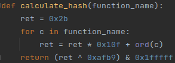(Figure 17)

There are several functions in the WINHTTP.dll library, we have listed the list and their hash below:

Il existe plusieurs fonctions dans la librairie WINHTTP.dll, nous vous avons mis la liste ainsi que leur hash ci-dessous :
| Function name                            | Hash     |
|------------------------------------------|----------|
| WinHttpAddRequestHeaders                 | 0x30c46  |
| WinHttpAddRequestHeadersEx               | 0xae11b  |
| WinHttpCheckPlatform                     | 0x6b78b  |
| WinHttpCloseHandle                       | 0xfd1fe  |
| WinHttpConnect                           | 0x105ed8 |
| WinHttpCrackUrl                          | 0xc17e7  |
| WinHttpCreateProxyResolver               | 0x1c0196 |
| WinHttpCreateUrl                         | 0x179ed3 |
| WinHttpDetectAutoProxyConfigUrl          | 0x3da33  |
| WinHttpFreeProxyResult                   | 0x7e3cf  |
| WinHttpFreeProxySettingsEx               | 0x1326e6 |
| WinHttpFreeQueryConnectionGroupResult    | 0x1fd8b2 |
| WinHttpGetDefaultProxyConfiguration      | 0xf3a15  |
| WinHTTPGetIEProxyConfigForCurrentUser    | 0x1ede7b |
| WinHttpGetProxyForUrl                    | 0x90c1e  |
| WinHttpGetProxyForUrlEx                  | 0xd1ef3  |
| WinHttpGetProxyResult                    | 0x16f077 |
| WinHttpGetProxySettingsEx                | 0x18d90e |
| WinHttpGetProxySettingsResultEx          | 0x12667d |
| WinHttpOpen                              | 0xa459a  |
| WinHttpOpenRequest                       | 0x66635  |
| WinHttpQueryAuthSchemes                  | 0xd893e  |
| WinHttpQueryConnectionGroup              | 0xe99bb  |
| WinHttpQueryDataAvailable                | 0xb8299  |
| WinHttpQueryHeaders                      | 0x9d98e  |
| WinHttpQueryHeadersEx                    | 0x20e63  |
| WinHttpQueryOption                       | 0x1d1f5d |
| WinHttpReadData                          | 0x64450  |
| WinHttpReadDataEx                        | 0x340f5  |
| WinHttpReceiveResponse                   | 0x128d32 |
| WinHttpRegisterProxyChangeNotification   | 0xcc8f4  |
| WinHttpResetAutoProxy                    | 0x4d760  |
| WinHttpSendRequest                       | 0x1ce2a7 |
| WinHttpSetCredentials                    | 0x3066a  |
| WinHttpSetDefaultProxyConfiguration      | 0x1b1659 |
| WinHttpSetOption                         | 0x1a5e67 |
| WinHttpSetStatusCallback                 | 0x1523c9 |
| WinHttpSetTimeouts                       | 0xafaa2  |
| WinHttpTimeFromSystemTime                | 0x6e475  |
| WinHttpTimeToSystemTime                  | 0x1636f4 |
| WinHttpUnregisterProxyChangeNotification | 0xd472d  |
| WinHttpWriteData                         | 0x17ea99 |
| WinHttpWebSocketClose                    | 0x5a5f3  |
| WinHttpWebSocketCompleteUpgrade          | 0xa29ec  |
| WinHttpWebSocketQueryCloseStatus         | 0x678e9  |
| WinHttpWebSocketReceive                  | 0x1ff53c |
| WinHttpWebSocketSend                     | 0x1568cf |
| WinHttpWebSocketShutdown                 | 0x12b0dd |

The fact that the size of these hashes is short allows several things, such as for example to lighten the malware or to develop shellcodes (which can be very interesting since there are often size restrictions when creating payloads ). It can also be noted that all the hashes are different, which makes it possible to be sure of not making the wrong call.

Now, all that remains is to inject the generated hashes into the IAT.
This technique is called **"IAT Hooking"** and the purpose of it is to rewrite the table to give it values that we have defined.
It is a technique that takes time to set up, but which is very effective.

For more info about this subject, we redirect you to [14], [15], [16].

## Binary Patching
**Binary Patching** is the process of modifying a binary file, like an executable or a library, by applying a set of changes to the file's binary data. These patches can be used to fix bugs, add new features, or change program behavior.

**Binary Patching** is not an obfuscation technique per se. It is more of a name that one could give to all the techniques which consist in modifying a program.

## Entry Point Obfscuring
**Entry Point Obfuscation** (EPO) is a way to camouflage the starting point of a program. This can be done by using packers, stripping a program, or using code virtualization (LLVM).

## Binary Striping | Symbol Stripping
**Binary Striping** is a method that allows you to remove several pieces of information from the executable, without changing the initial behavior of the program. This technique makes it possible to remove information such as the size, the layout of functions and objects as well as their locations in the code.

For example, software that is sold to third parties is mostly free of this data. This is intended to preserve the intellectual property of their program, as well as slow down the work of the person who would like to seize the code. This also has the benefit of reducing the size of the executable.

For example, softwares that are sold to third parties are often free of this data. THis is intended to preserve the intellectial property of their program, and thus slowing down the person that may want to steal the code.
This also has the benefit of reducing the size of the executables.

**Symbol Stripping** may be linked to **Binary Stripping** because this technique is used to only remove symbols that are present inside a table. Symbols are character strings that identify variables, functions, or any other code element. This makes it easier to read a code if there is a need for debugging behind it.

Where **Binary Stripping** involves stripping all data that is not needed by the program, symbol stripping involves stripping symbols that are normally included in the final executable of a program. There are several advantages to removing them, such as reducing the size of the executable, or removing data that could potentially help an attacker.

Figure 10 will show a simple Golang-coded program that prints "Hello, World!", which will be compiled for a Linux system, using the following command: ***GOOS=linux GOARCH=amd64 go build main.go** *

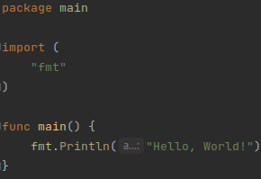 (Figure 10)

Compiled, this code, which has not been stripped, weighs 1.8M and contains no less than 38334 words (Figure 11).

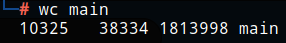 (Figure 11)

We want to make the executable as light as possible, because the less information there is in this program, the more complicated it will be to analyze it. First, it is possible to pass arguments to the compiler, which will reduce its size.

Hopefully, Golang allows you to remove certain information when compiling the program. From the previous command, just add the "-ldflags" option. This parameter is used to add information, such as a version number for example, to the executable when compiling it. *ld* means "Link Editor", and *flags* corresponds to the word which allows to change values during compilation. However, parameters must be given to this argument.

2 parameters are used when you want to strip a Go executable: -s; -w.
The -w parameter allows you to remove the "DWARF" *([5] Unix International)*, which corresponds to all the debug data that is included in the binary file.
With the executable obtained via the previous command, Figure 12 shows us the ELF (Executable and Linkable Format) information of this program.

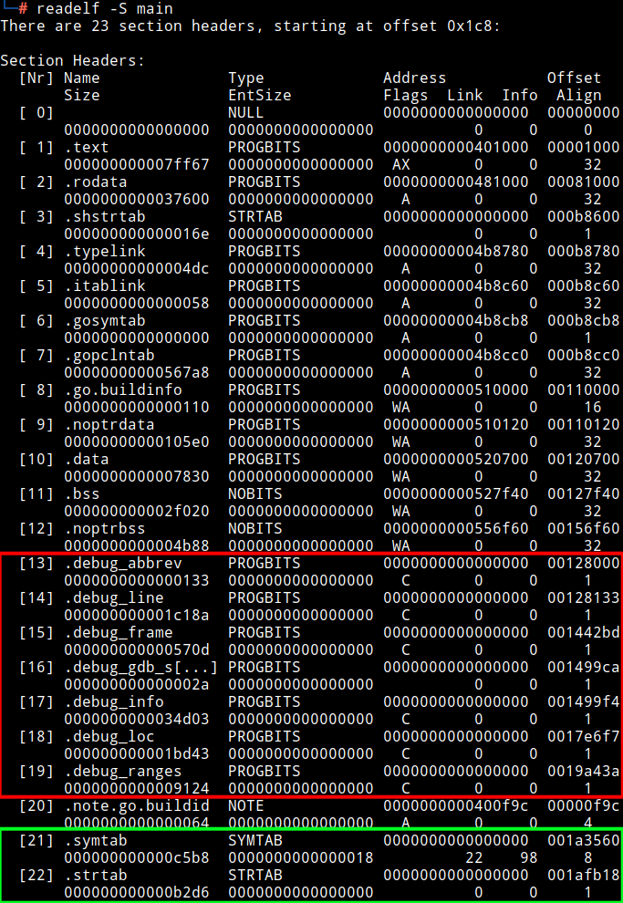(Figure 12)

We can see that there is debug information contained in the terminal output (red inset). This information greatly simplifies the work of an attacker. Several pieces of information remain unencrypted when decompiling the program, such as the names of functions/variables/classes; and other information such as a map that lists which variable has which memory address, etc. This is why it is necessary to remove this information when creating a program or a malware.

To remove them, simply do the following command: ***GOOS=linux GOARCH=amd64 go build -ldflags="-w" main.go***
As shown in Figure 13, by doing this command, we end up with a lighter executable (1.3M), as well as 27594 words.

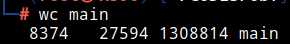 (Figure 13)

Moreover, figure 14 shows us that there is no longer any debug information in the program.

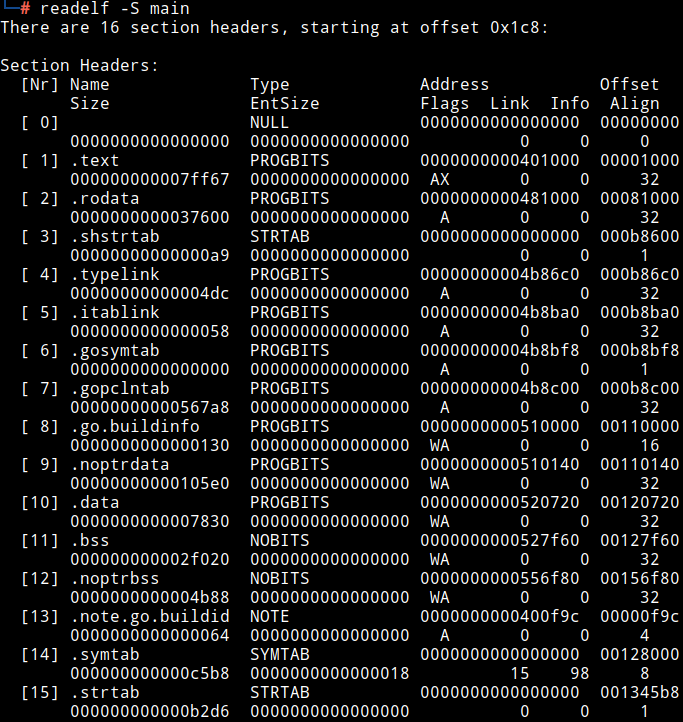 (Figure 14)

There is a second parameter which can be added to reduce the size of a Go executable. The "-s" attribute of the "-ldflags" argument makes it possible not to generate a symbol table. A symbol table (or symtab) is used to centralize information such as the relocation table which contains a list of pointers which is stored in the executable.

If we base ourselves on Figure 14 (green inset), we can see that there are 2 tables which are present: .symtab (symbol table) as well as .strtab (which is the table of the strings of the executable).

Figure 15 shows us the result of using these 2 parameters when recompiling  a program with the "-s" and "-w" arguments.

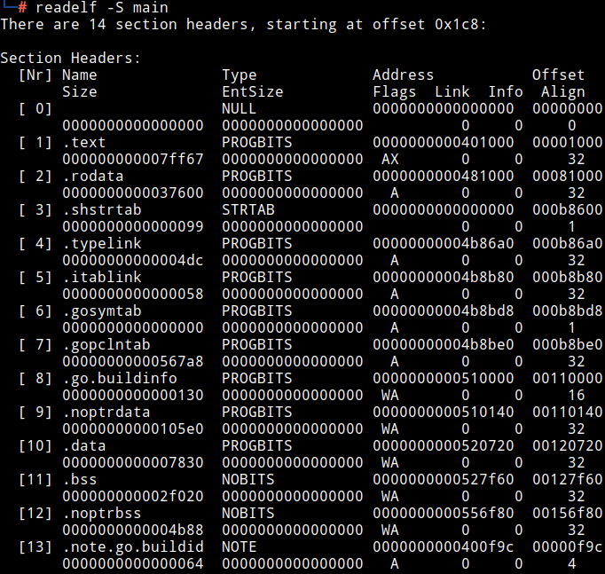 (Figure 15)

We also notice that the size of the executable has decreased again, this time we went from initially 1.8M, to 1.2M, with a total of more than 26550 words, as shown in Figure 16.

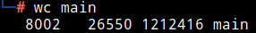 (Figure 16)

In the context of other programming languages, it is also possible to add parameters to them in order to considerably reduce the size of an executable. Nevertheless, we are going to see a technique that is common to everything.
Indeed, it is possible to "strip" an executable thanks to the **strip** command under a Linux based system.

Still with the command output present in Figure 12, it is also possible to remove a lot of information. It is possible to strip all symbols from an executable using the following command: ***strip --strip-all executable_file***. By running this command, Figure 17 shows us that we find the same result as in Figure 15.

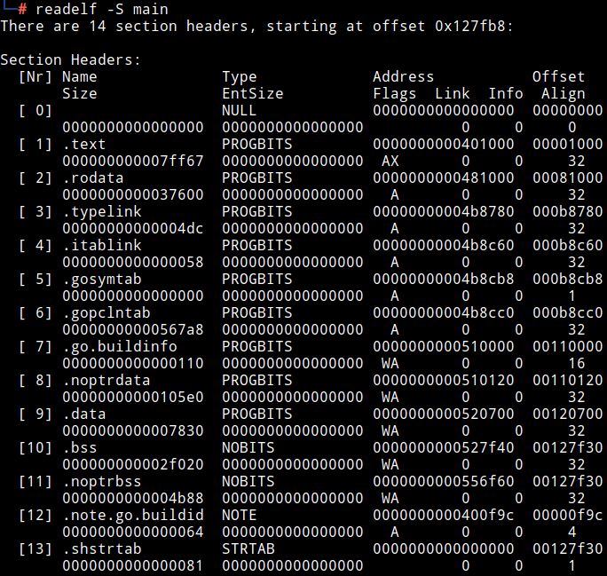(Figure 17)

It is possible to remove only some information from an executable, as explained thanks to this manual [6], because removing headers which are necessary for the program will not make it run.

"Dead Stripping" allows to remove all the **Dead Code** which are present in a program. This means that if there have been technical uses such as **Opaque Predicates**, then these pieces of code will be removed when using this tool. So it is recommended to be careful while using this tool.

It should be noted that it is more recommended to go through the language arguments when creating the executable than the strip command, but the use of both is also recommended.

### Probabilistic Obfuscation
***J. Stephens et al***[11] were the first to do a study on *Probabilistic Obfuscation*. It is a technique that consists of introducing randomization or uncertainty into a system so that it is more complicated to predict its final behavior. This can be done by adding noise to the data, mixing the different operations that there could be or even by using cryptographic means.

If we take a basic function that takes parameters as input, and returns a value at the end, using techniques as specified in the previous paragraph will allow us to prevent attacks that could predict the final result.

However, like all other obfuscation techniques, probabilistic obfuscation is not invulnerable, since it is possible to understand the implementation of the technique using statistics or even via machine learning algorithms.
Indeed, if we inject values several times into a function, and we compare the output value each time, it will be possible to make increasingly precise predictions, and thus understand how the program uses this technique.

On the other hand, ***A. Pawlowski et al***[12] claims that probabilistic obfuscation can partially thwart the dynamic analysis of a program and also de-obfuscation based on the analysis of the trace over several executions.

### Exceptions
Exceptions are blocks of code that are added to programs, preventing programs from stopping due to a bug. Several languages contain exceptions, such as Python, Java, C++ or OCaml.

This technique consists of using blocks like try/catch/finally, in order to be able to more difficultly control the flow of control of a program, and to do accordingly. As we can see in Figure 8, it is difficult to determine the value of "x", since it is necessary to understand how the program will behave.

This technique consists of using blocks like try/catch/finally, in order to be able to more difficultly control the flow of control of a program, and to do accordingly. As we can see in Figure 8, it is difficult to determine the value of "x", since it is necessary to understand how the program will behave.

*(The example below is not the most optimal, but it describes very well how this technique works)*
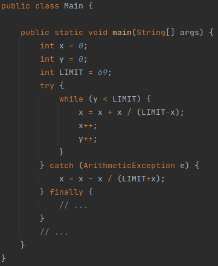 (Figure 8)

In addition, it is possible to add *Opaque Predicates*, which makes this technique more complex.
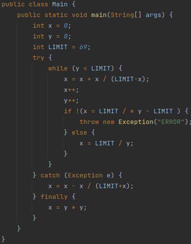 (Figure 9)

### Register reassignment
Registry reassignment (or renaming) is a deception technique as well as an anti-disassembly technique that makes the analyst's task more complicated. As explained by ***K. Brezinski et al*** [10] this consists of exchanging the value of registers from one generation to another without the behavior of the program changing.

When changing the value, it is possible to use a register that is used or not. **Register renaming** is very often used in hardware/industrial type environments, to protect against DPA (Differential Power Analysis) or SPA (Simple Power-Analysis) attacks, as demonstrated by ***D. May et al*** [8]

This is a technique that is often used by malware when creating their Payload. Indeed, ***B Jyothi Kumar et al*** [13] explains that malware often uses registry reassignment to be able to change the signature of their payload in order to bypass the defense systems that there could be .

RegSwap was one of the first malware to use this technique. [9]

Figure 17 shows a very basic example of register resignation, where you simply reassign one register to another.

| Before Obfuscation | After Obfuscation |
|--------------------|-------------------|
| mov eax, ecx       | mov ebx, ecx      |
| xor ebx, ebx       | xor eax, eax      |
| test eax, ebx      | test ebx, eax     | (Figure 17)

Nevertheless, this technique is very easily bypassed due to the fact that the values will remain constant during register changes. It is possible to do this thanks to attacks of the "Wildcard string scanning" type, which will quite simply ignore register changes, or even the *Half-Byte attack*, which consists of "shifting" part of a register to recover its initial value.

If this technique can also be used with other obfuscation techniques such as **Garbage Code**.
___
## Sources
- [[1] László, Tímea & Kiss, Ákos. (2007). Obfuscating C++ Programs via Control Flow Flattening. Annales Universitatis Scientiarum Budapestinensis de Rolando Eötvös Nominatae. Sectio Computatorica. 30](http://ac.inf.elte.hu/Vol_030_2009/003.pdf)
- [[2] Xu, D., Ming, J., & Wu, D. (2016). Generalized Dynamic Opaque Predicates: A New Control Flow Obfuscation Method. Information Security Conference](https://faculty.ist.psu.edu/wu/papers/opaque-isc16.pdf)
- [[3] J. Palsberg, S. Krishnaswamy, Minseok Kwon, D. Ma, Qiuyun Shao and Y. Zhang, "Experience with software watermarking," Proceedings 16th Annual Computer Security Applications Conference (ACSAC'00), 2000, pp. 308-316, doi: 10.1109/ACSAC.2000.898885](http://web.cs.ucla.edu/~palsberg/paper/acsac00.pdf)
- [[4] Collberg, Christian & Thomborson, Clark & Low, Douglas. (1997). Manufacturing Cheap, Resilient, and Stealthy Opaque Constructs. Conference Record of the Annual ACM Symposium on Principles of Programming Languages. 184–196. 10.1145/268946.268962](https://www2.cs.arizona.edu/~collberg/content/research/papers/collberg98manufacturing-clean.pdf)
- [[5] DWARF Debugging Information Format; Unix International](https://dwarfstd.org/doc/dwarf-2.0.0.pdf)
- [[6] man strip](https://man7.org/linux/man-pages/man1/strip.1.html)
- [[7] Ros, Montserrat & Sutton, Peter. (2005). A post-compilation register reassignment technique for improving hamming distance code compression. CASES 2005: International Conference on Compilers, Architecture, and Synthesis for Embedded Systems. 97-104. 10.1145/1086297.1086311](https://ro.uow.edu.au/cgi/viewcontent.cgi?referer=&httpsredir=1&article=1446&context=eispapers)
- [[8] May, David & Muller, Henk & Smart, Nigel. (2001). Random Register Renaming to Foil DPA. 2162. 28-38. 10.1007/3-540-44709-1_4](https://web.archive.org/web/20040613024451/http://exchange.ee.princeton.edu:80/~zshi/papers/ches01/21620028.pdf)
- [[9] RegSwap malware](https://crypto.stanford.edu/cs155old/cs155-spring09/papers/viruses.pdf)
- [[10] Brezinski, Kenneth & Ferens, K.. (2021). Metamorphic Malware and Obfuscation -A Survey of Techniques, Variants and Generation Kits. 10.13140/RG.2.2.19702.52802](https://www.researchgate.net/publication/357255382_Metamorphic_Malware_and_Obfuscation_-A_Survey_of_Techniques_Variants_and_Generation_Kits)
- [[11] J. Stephens, B. Yadegari, C. Collberg, S. Debray and C. Scheidegger, "Probabilistic Obfuscation Through Covert Channels," 2018 IEEE European Symposium on Security and Privacy (EuroS&P), 2018, pp. 243-257, doi: 10.1109/EuroSP.2018.00025](https://www2.cs.arizona.edu/people/debray/Publications/covert-channels.pdf)
- [[12] Pawlowski, Andre & Contag, Moritz & Holz, Thorsten. (2016). Probfuscation: An Obfuscation Approach Using Probabilistic Control Flows. 165-185. 10.1007/978-3-319-40667-1_9](https://web.archive.org/web/20190220191140/http://pdfs.semanticscholar.org/26c3/3651056e8fd7690ca6ae1c19389482d515a0.pdf)
- [[13] Kumar, B & Naveen, H & Kumar, B & Sharma, Sai & Villegas, Jaime. (2017). Logistic regression for polymorphic malware detection using ANOVA F-test. 1-5. 10.1109/ICIIECS.2017.8275880](https://www.researchgate.net/publication/322994335_Logistic_regression_for_polymorphic_malware_detection_using_ANOVA_F-test)
- [[14] import-adress-table-iat-hooking](https://www.ired.team/offensive-security/code-injection-process-injection/import-adress-table-iat-hooking)
- [[15] offensive-iat-hooking](https://pentest.blog/offensive-iat-hooking/)
- [[16] iat_hooking](https://f3real.github.io/iat_hooking.html)