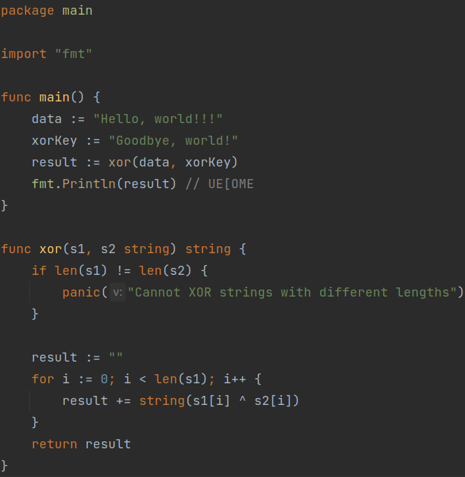

## Decoy Code
This technique consists of "exploding" a variable assignment. Which means that instead of assigning a variable in the usual way, it will be necessary to decompose this assignment a certain number of times. Figure 1 shows us how it is possible to proceed. This is a technique that deserves to be used, even if it takes some time to do, it allows you to add code instructions, and thus slow down the reverse engineering process of the code.

 (Figure 1)

## String Obfuscation
A simple method of obfuscating a code is simply to encrypt, encode, decompose a string. This allows you to do several things, such as escaping signature-based detection systems, or hiding the content of the data so that it is not easily findable in a code.

### Encoding
To hide data, it is possible to encode it using basic algorithms such as base32/64 [2]. This makes it possible, for example, to camouflage character strings so that they are not intercepted by defense systems, it is nevertheless very easy to do the opposite operation, so this technique must be used with other methods such as encryption. to improve data obfuscation.

### Encryption
It is possible to hide data by encrypting it. Indeed, a string can be encrypted during the writing of the code, then decrypted during its execution. However, this technique has some drawbacks.

If a string has been encrypted using an a/symmetric encryption algorithm and the code needs said string to continue executing, then it needs to decrypt it. This means that the decryption key is either **Hard Coded** in the code (de/encryption key written directly in the program), or the program receives the key from an external server.

Either way, an attacker will necessarily find the key, and will therefore be able to decrypt the necessary data.

Nevertheless, assuming that the purpose of obfuscation is to waste an attacker's time as much as possible, it is still useful to encrypt the sensitive data it contains, as long as the decryption key is sufficiently obfuscated.

## XOR
The use of XOR in a code makes it possible to obfuscate a code by "encrypting" the data it contains.

To be able to obfuscate data using XOR, you must first create a key, which will be XORed on the initial data, and thus will output encrypted data. As explained by ***H. Jameel Asghar et al*** [1], if the size of the key is equal to the size of the data to be encrypted, then the encryption will be cnosidered secure. However, if the data to be encrypted is very long, malware tends to use a small key, and reuse this key on pieces of data equivalent to its size.

As shown in Figure 2, as long as the size of the key is equivalent to the size of the data, then the encryption is very secure.

(Figure 2)

___
### Sources
- [[1] H. Jameel Asghar, B. Zi Hao Zhao, M. Ikram, G. Nguyen, D. Kaafar, S. Lamont, D. Coscia; SoK: Use of Cryptography in Malware Obfuscation](https://eprint.iacr.org/2022/1699.pdf)
- [[2] Rosetta Code](https://rosettacode.org/wiki/Base64_encode_data)