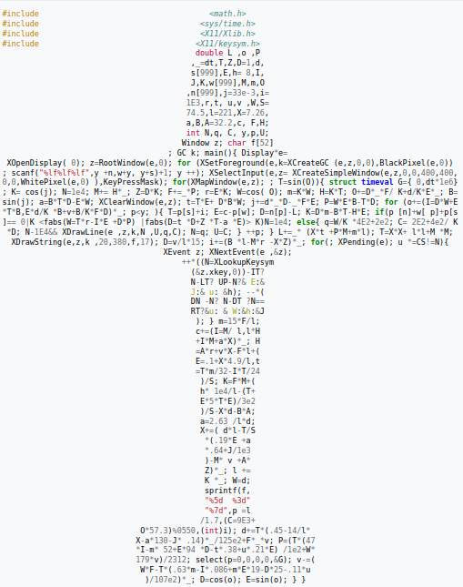

## History of obfuscation
Today, our systems are protected on several levels, such as hardware, software, or the source code of a program. In this technical document, we will look at what program obfuscation is as well as source code obfuscation in general, how it was invented, and why it is a necessary technique to apply.

Obfuscation is the art of changing the source code of a program, without affecting its semantics or its basic operation.
Its purpose is to change the appearance of the code in any way, such as by adding code, changing the order of the code, adding post-compilation instructions, etc., to make the code intelligible and for the human who could read it, and sometimes even for the computer.
By using these techniques, an attacker will have to spend considerably more time when he wants to decompile the program, to be able to recover the intelligence of the product.
Apart from this problem, obfuscating a program also allows you to protect the intellectual property as well as the registered trademark of said program.

The first obfuscated codes appeared in 1984, during the first edition of the IOCCC [1] (**Internet Obfuscated C Code Contest**), and led to a first technical report in 1997 [10]. The goal of this competition is to create the most confusing and incomprehensible code possible [2], to surprise the judges with non-standard means and to hide the true purpose of the code. 
The rules of the competition are rewritten every year, and to make this contest more fun, there are some kinds of loopholes in these rules, and it is very advisable to exploit them! After that, you are free to choose your project and do what you want!

*Hacking the contest rules is a tradition. —Landon Curt Noll, 2011*

Among the projects that were presented, there were several achievements:
- A 32-bit operating system that supports multitasking (2004) - 3.47 KB - [6]
- A complete chess game, with legal moves (2005) - 1255 char - [7]
- Airplane simulator, with landing in Pittsburgh (1998) - 2.2 KB - [8]

There are hundreds of other programs like these, and they are all available on their Github [9].

The creators of the IOCCC (Landon Curt Noll and Larry Bassel) came to this idea when they had to correct very poorly written codes, such as the famous "Bourne Shell" (sh) code[3].
It is noted that the IOCCC is to this day the oldest internet competition still in existence[4].

 **Flying simulator program**

### Why do we need code obfuscation?
It’s true that obfuscation is something we don’t hear much about. Even the developers themselves don't necessarily know what it is, or what it is for. However, it is a technique widely used by malware developers as well as video game studios.

We need obfuscation as much as encryption in a program, because this allows us to maintain a sort of "confidentiality" of the data. As said above, this method also allows you to preserve your intellectual property. Indeed, certain data can be written in hard copy: IP/PORT address, seed, encryption key (yes, this can happen...), and this same data does not need to be read by a third person. This is where use code obfuscation come to play.

Knowing this, can we say that obfuscation = encryption?

Encryption is a method of transforming data, which requires an input key. This makes the data unreadable, and in the case of an asymmetric encryption, theoretically impossible to have the opposite effect.

As for obfuscation, it is also a transformation of the data, which does not necessarily need a key (we will see later why it is possible to use a key.), and which can be reversed.

One of the obfuscation techniques is simply string encryption. If, for example, you have strings that are hard-coded in your code, and you don't want a third party to know what data they contain, you can for example encrypt this data to protect it. But it is also possible to encode a string to be able to obfuscate a code, but a third person will be able to read it.

### Are companies obfuscating their code?
Several companies use obfuscation to avoid theft/copy/reproduction of their program, such as Adobe, Google, Activision and so on. Speaking of Activision, it is one of the video game studios that most use obfuscation to protect the program. Indeed, when video games are available to the public, they are very quickly targeted by hackers, and in general, it does not take them very long to be able to break the game code.

For example, when the game Bioshock was released (2007), it only took 13 days to be able to analyze, understand and exploit the game code: "We achieved our goals. We were uncracked for 13 whole days. We were happy with it." *Martin Slater, senior programmer for 2K Australia*[5]

### Difficulties of obfuscation
The difficulty of this method simply depends on the level at which the program must be protected. This can be when compiling the program, for example in Golang, were it is possible to remove the symbols from the Linux/Windows tables as well as the debug information with the following argument: *-ldflags="-s -w "*.

This can also be before compilation, by doing "Layout obfuscation", which is the modification of the structure of the code by for example by adding "dead code" (code which is of no use, but which is still used in the program) or by transforming the strings into lists. Almost all of these techniques will be described in the **Ofuscation techniques** section.

As a result, a huge number of techniques are available, and at all levels. It just depends on the degree of security that we want to grant to a program (not counting the time required).

___
### Sources
- [[1] Internet Obfuscated C Code Contest (IOCCC)](https://www.ioccc.org/)
- [[2] Как я участвовал в IOCCC-'19 (и проиграл). Часть 1: «Крестики-нолики»](https://habr.com/ru/post/505044/)
- [[3] History of IOCCC](https://en.wikipedia.org/wiki/International_Obfuscated_C_Code_Contest#History)
- [[4] Oldest internet competition](https://www.pcworld.com/article/478306/obfuscated_code_contest_returns.html)
- [[5] Bioshock 2007 remained uncracked for 13 days](https://www.rockpapershotgun.com/bioshock-the-future-of-copy-protection)
- [[6] OS in 3.47 KB written in C for the IOCCC](https://github.com/ioccc-src/winner/blob/master/2004/gavin.c)
- [[7] Complet chess game (The code looks like a knight upside down)](https://github.com/ioccc-src/winner/blob/master/2005/toledo/toledo.c)
- [[8] Flight Simulator](https://github.com/ioccc-src/winner/blob/master/1998/banks.c)
- [[9] Github IOCCC](https://github.com/ioccc-src/winner)
- [[10] Collberg, Christian & Thomborson, Clark & Low, Douglas. (1997). A Taxonomy of Obfuscating Transformations. http://www.cs.auckland.ac.nz/staff-cgi-bin/mjd/csTRcgi.pl?serial](https://www.dsi.unive.it/~avp/collberg97taxonomy.pdf)
