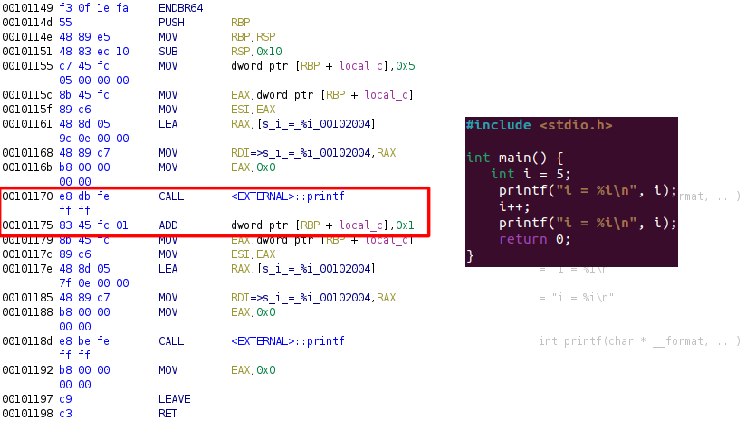
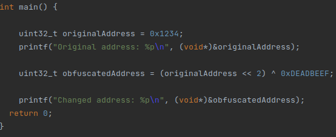
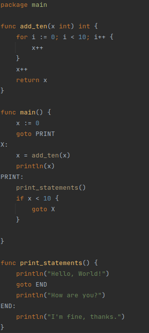
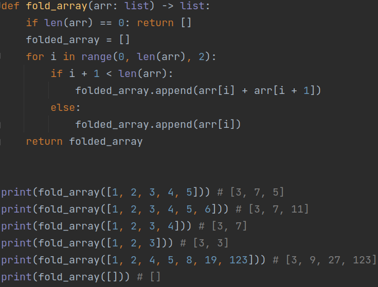
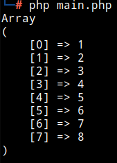
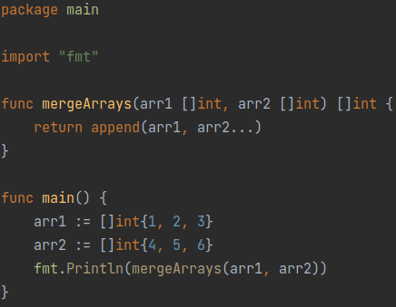

## Junk Codes / Junk Data
***C. Collbert et al*** [9] where the first to talk about the usage of **Junk Codes**. It's an obfuscation technique often used by malware operators to evade signature-based analysis. For example, parts of the code may make API calls that are useless for the program.

The best way to use **Garbage Code** is for example, creating functions that contains meaningless code, and calling the functions at some random point of the code so that the analysis tools that may be used against your malware won't erase those "useless functions".

The Figure 1 shows an example of a simple code that increments the variable. This code does not contain any **Dead Code**
 (Figure 1)

Nevertheless, it is possible to add some **Dead Code** by using assembly calls inside the program. Shown in the Figure 2 in the highlighted part, a simple **NOP** has been put inside the code, thus moving every memory addresses of 1 bit.

It should be noted that this technique in particular is not the best to use because of the **NOP** operator, because analysis often removes those calls knowing that it won't alter the program's well-being
 (Figure 2)

Like the **Junk Code**, the **Junk Data** is a deception method that consist in adding, like the name say, junk data either when sending/receiving data, or directly inside your code, as an encoded or encrypted data.

**Junk Codes** can be used in several ways, for example, junk data can be added at the beginning or the end of a string during communication between a malware and a C2, or a number that is going to be modified (when using left/right shifting), or as data that has no use.

When **Opaque Predicates** are used, **Junk Data / Junk Code** are also used, because most of the data that is used to create an Opaque Preciate is useless.

## Separating related code
This technique is pretty simple since it can combine the **Junk Data / Junk Code** techniques.

Indeed, when writing a code, it is recommanded to separate the parts of the code that are "linked" together, and to add useless code between these parts. However, the use of the **Junk Code** is not necessary for this technique.

Using this technique in programs will slow down the reverse engineering process because the static analysis tools that may be used won't know which part pf the program is used or not.

## Meaningless Identifiers
In a program, Identifiers are the name that we give to a variable, a function, or every object that is used in a code.

**Meaningless Identifiers** (or **Lexical Obfuscation**) is the act of renaming every single identifier of a code, in order to make the code completly intelligible, thus meaningless, so that it is impossible for someone to determine the real purpose of that object.

***H. Xu et al*** [6] explains that it is necessary to use meaningfull identifiers so that a program can be maintanable and clean. They also indicate that it is possible for some identifiers (e.g Global Variables) may stay in plaintext during the compilation, thus facilitating the adversaries work.

**Lexical Obfuscation** is often used in interpreted languages, such as Python or Javascript, because they are easily understandable and therefore more likely to be targeted by attackers.

The Figure 3 shows an example of a code that does not contain any obfuscated identifiers, and the Figure 4 shows the obfuscated version of it

 (Figure 3)

 (Figure 4)

Even if the codes are the same, it is easily possible to see that the obfuscated version requires more time to read than the non-obfuscated version, the goal of it being to waste time and also discourage the opponent.

## Memory Address Obfuscation
**Memory Address Obfuscation** is a program transformation technique that allows manipulation of the used memory addresses. As described by ***S. Bhatkar et al*** [4], the purpose of this technique is to "randomize" the virtual addresses of a program each time it is launched.

To do so, it is possible to use different techniques like encryption, **"Bit Shifting"** or even **"Modular Arithmetic"**, which are simple techniques to implement.

Another aspect of this technique is that it also makes it possible to complicate the task of injecting code into the executable, because the addresses are difficult or even unpredictable, an attacker will have to spend considerably more time to find a place vulnerable.
In addition, this helps prevent several attacks, such as **"Buffer Overflow"** or **"Stack Smashing"**[5] (or also called **"Stack Cookies"**), which are types of attacks that are very common in languages like C or C++, since the developer has extreme control over memory, which is more error-prone.

New generation languages such as Golang or Rust are "Memory safe", which means that it prevents programs from vulnerabilities that are memory-related (such as **"Buffer Overflow"**). It should be noted that the Java language is also considered *Memory Safe*.

This obfuscation technique is often used with other security measures, such as **"Stack Canaries"**[5] or *"Address space layout randomization" (ASLR)*, which provides an additional layer of security. However, ASLR cannot be activated on a particular program, but directly on a system.

Figure 5 and 6 will present a general idea of this technique, which means that it is not complete, and that it requires additional code such as memory allocation.

As we can see in Figure 5, we use a series of mathematical operations (*"Bit shifting"* + XOR) which allows us to mix the memory address of a variable. Figure 6, on the other hand, will show the theoretical result of the code.

(Figure 5)

(Figure 6)

## Code transposition / Subroutine Reordering
According to ***K. Brezinski et al*** [1], code transposition and function reorganization (Subroutine Reordering) are very similar.

Code transposition (or instruction swapping) is the act of using conditional or unconditional "jumps" in order to reorder some or all blocks of code. It is possible to do as many code transpositions as there are possible lines in it. Since it is theoretically possible to use a "jmp" for each line of code present, ***K. Brezinski et al*** [1] demonstrates the fact that it is possible to make m! (factorial of m) transposition.

Function reordering is very similar to code transposition, except that it involves reordering entire functions, as opposed to reordering chunks of code. ***I. You et al*** [2] specifies that this technique is better if it is done randomly, since we can generate n! (factorial of n) different variant of code, where the value "n" is the number of routines that a code can have and therefore n possible signature. For example, if there are 7 functions for a program, it is possible to create 5040 programs with a different signature.

La Figure 7 représente une transposition d'un code basique, et la Figure 8 fais une représentation assembleur de ce même code.

(Figure 7)

(Figure 8)

## Array transformation
There are several ways to obfuscate an array. Many of these techniques have been exposed by ***C. Collbert et al*** [3] in their paper published in 1998. ***S. Drape*** [7] explains that the easiest way to obfuscate a list is to change its indices.

### Array Splitting
**Array Splitting** is a method that consists of taking a 1-dimensional array, and splitting it into 2 or more parts, each containing a part of the initial array. Figure 9 shows how this technique is used in a simple way, while Figure 10 shows a bit more advanced use.

(Figure 9)

(Figure 10)

### Array Folding
**Array Folding** or **Array Collapsing** is the process of reducing a one-dimensional array by combining adjacent elements. This is often used for data compression or to simplify some calculations.

There are several ways to implement this technique and the specific approach we should use will depend on the specific needs of the program. We can deduce that there are 3 possible *Array Folding* techniques:
- Recursively combining the first as well as the last element of the list, and returning the result
- Iterating over the list in steps of X and combining items at each step
- Iterating over the list and combining items based on a specific pattern or rule

Figure 11 shows a use case of the first technique:
(Figure 11)

### Array flatenning
***W. Zhu et al*** [8] explain that *Array Flatenning* is the act of reducing the number of dimensions that a list could have in a program. Figure 12 shows a multi-dimensional array being reduced to a one-dimensional array.

The difference between **Array Flatenning** and **Array Folding** is the way the data is processed. Indeed, the goal of the **Array flatenning** is to reduce the number of dimensions that certain lists could have, but the **Array Folding** is the technique which reduces the number of indices that a list may have. We can see that in Figure 11, the arrays that are used are 1-dimensional, while Figure 12 contains a multi-dimensional array.

(Figure 12)

(Figure 13)

### Array merging
This technique consists of simply combining 2 lists into one. This makes it possible to combine similar data, as well as simplify it to facilitate certain operations. Figure 14 shows the use of this technique.

(Figure 14)

___
## Sources
- [[1] Brezinski, Kenneth & Ferens, K.. (2021). Metamorphic Malware and Obfuscation - A Survey of Techniques, Variants and Generation Kits 10.13140/RG.2.2.19702.52802](https://www.researchgate.net/publication/357255382_Metamorphic_Malware_and_Obfuscation_-A_Survey_of_Techniques_Variants_and_Generation_Kits)
- [[2] You, Ilsun & Yim, Kangbin. (2010). Malware Obfuscation Techniques: A Brief Survey. Proceedings - 2010 International Conference on Broadband, Wireless Computing Communication and Applications, BWCCA 2010. 297-300. 10.1109/BWCCA.2010.85](https://web.archive.org/web/20170922003956/http://isyou.hosting.paran.com/papers/bwcca10-2.pdf)
- [[3] Collberg, C. & Thomborson, Clark & Low, D.. (1998). Breaking abstractions and unstructuring data structures. 28-38. 10.1109/ICCL.1998.674154](https://www2.cs.arizona.edu/~collberg/content/research/papers/collberg98breaking.pdf)
- [[4] Bhatkar, Sandeep & DuVarney, Daniel & Sekar, Ramachandran. (2003). Address Obfuscation: an Efcient Approach to Combat a Broad Range of Memory Error Exploits. 3](https://www.usenix.org/legacy/events/sec03/tech/full_papers/bhatkar/bhatkar.pdf)
- [[5] Bierbaumer, B., Kirsch, J., Kittel, T., Francillon, A., Zarras, A. (2018). Smashing the Stack Protector for Fun and Profit. In: Janczewski, L., Kutyłowski, M. (eds) ICT Systems Security and Privacy Protection. SEC 2018. IFIP Advances in Information and Communication Technology, vol 529. Springer, Cham. https://doi.org/10.1007/978-3-319-99828-2_21](https://www.s3.eurecom.fr/docs/ifip18_bierbaumer.pdf)
- [[6] Xu, Hui & Zhou, Yangfan & Ming, Jiang & Lyu, Michael. (2020). Layered obfuscation: a taxonomy of software obfuscation techniques for layered security. Cybersecurity. 3. 9. 10.1186/s42400-020-00049-3](https://cybersecurity.springeropen.com/articles/10.1186/s42400-020-00049-3)
- [[7] Drape, S. Intellectual Property Protection Using Obfuscation. 2010](https://www.cs.ox.ac.uk/files/2936/RR-10-02.pdf)
- [[8] W. Zhu, C. Thomborson and Fei-Yue Wang, "Obfuscate arrays by homomorphic functions," 2006 IEEE International Conference on Granular Computing, 2006, pp. 770-773, doi: 10.1109/GRC.2006.1635914](http://profs.sci.univr.it/~giaco/download/Watermarking-Obfuscation/Array-offusaction.pdf)
- [[9] Collberg, Christian & Thomborson, Clark & Low, Douglas. (1997). A Taxonomy of Obfuscating Transformations.](https://www.researchgate.net/publication/37987523_A_Taxonomy_of_Obfuscating_Transformations)